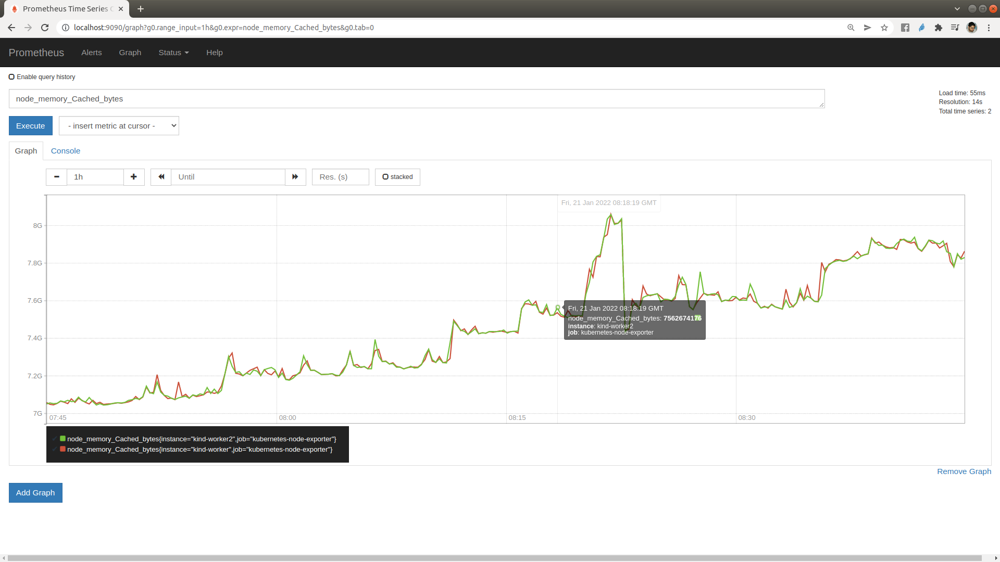
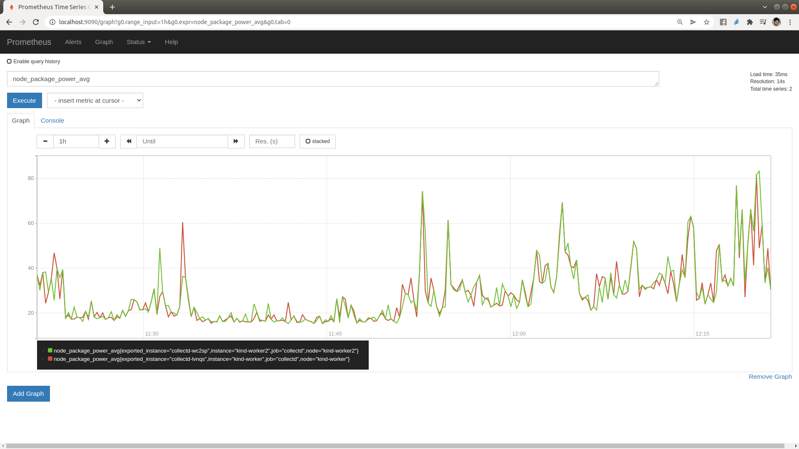

# Intel's Platform-Aware-Scheduling

This documentation copies parts of the documentation from the [main repo](https://github.com/intel/platform-aware-scheduling). 


Platform Aware Scheduling (PAS) contains a group of related projects designed to expose platform specific attributes to the Kubernetes scheduler using a modular policy driven approach. The project contains a core library and information for building custom scheduler extensions as well as specific implementations that can be used in a working cluster or leveraged as a reference for creating new Kubernetes scheduler extensions.

Telemetry Aware Scheduling is the initial reference implementation of Platform Aware Scheduling. It can expose any platform-level metric to the Kubernetes Scheduler for policy driven filtering and prioritization of workloads. You can read more about TAS [here](https://github.com/intel/platform-aware-scheduling/tree/master/telemetry-aware-scheduling).

## Telemetry Aware Scheduling

Telemetry Aware Scheduler Extender is contacted by the generic Kubernetes Scheduler every time it needs to make a scheduling decision. The extender checks if there is a telemetry policy associated with the workload. If so, it inspects the strategies associated with the policy and returns opinions on pod placement to the generic scheduler. The scheduler extender has two strategies it acts on - scheduleonmetric and dontschedule. This is implemented and configured as a [Kubernetes Scheduler Extender](https://kubernetes.io/docs/concepts/configuration/manage-compute-resources-container/#cluster-level-extended-resources). 

The Scheduler consumes TAS Policies - which is a Custom Resource. The extender parses this policy for deschedule, scheduleonmetric and dontschedule strategies and places them in a cache to make them locally available to all TAS components. It consumes new Telemetry Policies as they are created, removes them when deleted, and updates them as they are changed. The extender also monitors the current state of policies to see if they are violated. For example if it notes that a deschedule policy is violated it labels the node as a violator allowing pods relating to that policy to be descheduled.

### Quick Setup

The [deploy folder](https://github.com/intel/platform-aware-scheduling/tree/8529a6b/telemetry-aware-scheduling/deploy) has all of the yaml files necessary to get Telemetry Aware Scheduling running in a Kubernetes cluster. Some additional steps are required to configure the generic scheduler and metrics endpoints. Here are the steps:

- Deploy the [custom metrics pipeline](https://github.com/intel/platform-aware-scheduling/blob/master/telemetry-aware-scheduling/docs/custom-metrics.md). Once the custom metrics is deployed correctly, running 

  
  ```bash
  kubectl get --raw /apis/custom.metrics.k8s.io/v1beta1 | grep nodes | jq . 
  ```
  should return a number of metrics that are being collected by prometheus node exporter, scraped by prometheus and passed to the Kubernetes Metrics API by the Prometheus Adapter. One example metrics collection is as follows:
  

  ```bash

  kubectl get --raw /apis/custom.metrics.k8s.io/v1beta1/nodes/*/memory_Cached_bytes | jq .

  {
    "kind": "MetricValueList",
    "apiVersion": "custom.metrics.k8s.io/v1beta1",
    "metadata": {
      "selfLink": "/apis/custom.metrics.k8s.io/v1beta1/nodes/%2A/memory_Cached_bytes"
    },
    "items": [
      {
        "describedObject": {
          "kind": "Node",
          "name": "kind-worker",
          "apiVersion": "/v1"
       },
        "metricName": "memory_Cached_bytes",
        "timestamp": "2022-01-21T08:32:03Z",
        "value": "7560781824",
        "selector": null
      },
      {
        "describedObject": {
          "kind": "Node",
          "name": "kind-worker2",
          "apiVersion": "/v1"
      },
        "metricName": "memory_Cached_bytes",
        "timestamp": "2022-01-21T08:32:03Z",
        "value": "7560638464",
        "selector": null
      }
    ] 
  }
  ```

You can explore the custom metrics values on prometheus dashboard as well. Here is an example:



In order to be certain the raw metrics are available look at a specific endpoint output from the above command e.g. `kubectl get --raw /apis/custom.metrics.k8s.io/v1beta1/nodes/*/health_metric | jq .`

- Follow the steps described [here](https://github.com/intel/platform-aware-scheduling/tree/master/telemetry-aware-scheduling#extender-configuration). There's an extender configuration example [here](https://github.com/intel/platform-aware-scheduling/tree/master/telemetry-aware-scheduling/deploy/extender-configuration). 

- Deploy TAS(Telemetry Aware Scheduling) following the steps [here](https://github.com/intel/platform-aware-scheduling/tree/master/telemetry-aware-scheduling#deploy-tas).

- Deploy [Power Driven Scheduling and Scaling with CPU telemetry in Kubernetes](https://github.com/intel/platform-aware-scheduling/blob/master/telemetry-aware-scheduling/docs/power/README.md). Once you follow all the steps described above you will have the following:

  - Deployed collectd and prometheus adapter. This exposes node's energy metrics to kubernetes and prometheus. Check the following picture for an example. 
  
  

  - Deployed Kube state metrics and makes it available to prometheus. 

  - Deployed TAS Telemetry Policy for power. You can check the policy as follows:
  
  ```bash

  kubectl describe taspolicy power-sensitive-scheduling-policy
  Name:         power-sensitive-scheduling-policy
  Namespace:    default
  Labels:       <none>
  Annotations:  API Version:  telemetry.intel.com/v1alpha1
  Kind:         TASPolicy
  Metadata:
    Creation Timestamp:  2021-12-13T13:15:53Z  
  Spec:
    Strategies:
      Dontschedule:
        Rules:
          Metricname:  package_power_avg
          Operator:    GreaterThan
          Target:      60
      Scheduleonmetric:
        Rules:
          Metricname:  package_power_avg
          Operator:    LessThan
  Events:              <none>
  
  ```

  - Deployed horizontal autoscaler for power. The Horizontal Pod Autoscaler is an in-built part of Kubernetes which allows scaling decisions to be made based on arbitrary metrics. In this case we're going to scale our workload based on the average power usage on nodes with current instances of our workload.

  - Deployed power sensitive application. TAS schedules it to the node with the lowest power usage, and will avoid scheduling to any node with more than 80 percent of its TDP currently in use. 

### Disadvantages

The disadvantages are:

- This tool would only work on Intel processors. That also only Sandybridge architecture onwards where RAPL is available.

- The process has been tested with k8s 1.21.1. It would require some changes in config files to make it work with k8s 1.22. This has not been tested. 