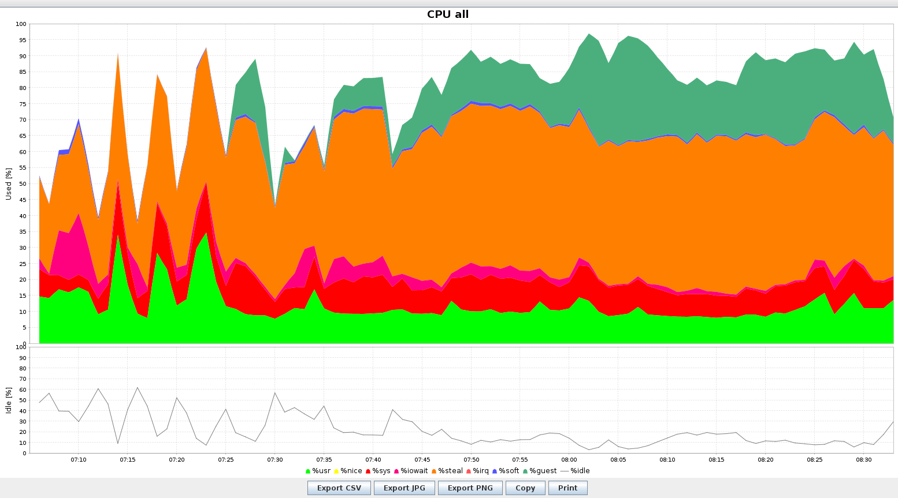

# CI metrics analysis

The Jenkins archive tarball contains files under the 'metrics/' directory which
includes recordings of the instance's resource usage during the CI run.

It can be helpful to examine these to see if there are underlying
infrastructure reasons for build failures or build slowness.

Three utilities are used for recording the metrics:

* sar - records system resource usage: CPU, memory, I/O, network and kernel
  behaviors
* atop - records the history of per-process resource usage
* Prometheus - records in-cluster application and pod metrics, as well as some
  metrics for the node based on telegraf

## Reading the metrics

### sar (aka sysstat)

sar is saved to a binary file 'sa<day-number>' in the metrics/sysstat
directory.

After installing `sysstat` on your local machine, the metrics can be converted
to a readable text file with:

`LC_TIME=POSIX sar -A -t -f ./sa28`

There's a nice utility which will let you browse and plot the metrics called
kSar:

https://github.com/vlsi/ksar/releases

Download the *latest snapshot build* from here, and pair with a modern java
JDK. Then run with:

`java -jar ~/Downloads/ksar-5.2.4-b396_gf0680721-SNAPSHOT-all.jar`

From here, you can open the plaintext sar file and see the graphs.

### atop

atop is saved to a binary file in metrics/atop directory.

It can be read with:

`atopsar -A -r atop_20211020`

See `?` for the help page. You can navigate backward and forward through the
timestamps with `t` and `T`.

### Prometheus

WIP. A tool called 'krew' is used to dump the Prometheus database from in the
cluster. In theory, it should be possible to spin up a Prometheus instance
using the database to query and graph the metrics from the database dump.

TODO: update once Prometheus metrics are working (KB-529)

## Top problems to watch out for

* CPU steal happens when requests for CPU for our VM are queued behind requests
  from other VMs on the same physical host in CityCloud's datacentre. Even a
  small amount of CPU steal will heavily impact CPU performance. If CPU is over
  5%, it's likely that the job will take noticeably longer and performance is
  impacted. You can see CPU steal as an orange area on the CPU graph.

* I/O latency is how long the I/O layer takes to fetch a read or acknowledge
  that a write has been written to disk. etcd in particular, as a database,
  requires low I/O latency to work properly, and recommends that 99% of I/O
  requests are served within 10ms. If there are spikes in I/O latency, etcd
  failures may be visible in the job.

## Metrics deployment

Metrics are deployed into the CI image used for the OpenStack instances in the
image provisioning scripts:

* https://github.com/Nordix/airship-dev-tools/blob/master/ci/scripts/image_scripts/setup_monitoring_ubuntu.sh
* https://github.com/Nordix/airship-dev-tools/blob/master/ci/scripts/image_scripts/setup_monitoring_centos.sh

## Known issues with metrics

TODO:

* Sometimes metrics are corrupted. We need to make sure all the metrics
  gathering services are stopped before copying the files in the tarball.
* CentOS sar metrics are not saved to the correct location and aren't present
  in the tarball.
* Prometheus metrics are untested
