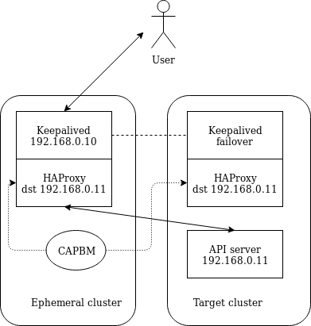

# Load balancer on the ephemeral cluster

CAPBM could be modified to deploy a load balancer (in v1alpha2) in the ephemeral
cluster. In v1alpha3, the load balancer aspect is still under design. CAPBM
would update the load balancer configuration when changes happen for control
plane nodes. The load balancer pod would be in host networking mode and run a
keepalived sidecar for the api endpoint IP address.

As soon as the first node would be ready, the load balancer can be deployed on
the target cluster as a daemon set. An implementation of a cloud provider could
reconfigure it when needed.

When removing the ephemeral node, the API endpoint would move to the target
cluster with Keepalived.

The process would go as follow :

* While creating a baremetal cluster, CAPBM would instantiate a load balancer
  (for example HAProxy) with a keepalived sidecar container, in host networking
  mode on the data network of the target cluster
* When creating or deleting baremetal machines, CAPBM would update the
  configuration of the load balancer.
* Once the control plane of the target cluster is initialized, a load balancer
  daemon set can be deployed, running for example HAProxy and keepalived with
  the same router ID as in the ephemeral node, but with a higher priority.
* Once the daemon set is up, the load balancing will happen on the target
  cluster
* The ephemeral node / load balancer on the ephemeral node can be removed

The following changes would be needed :

* we need to extend the baremetalcluster object to support the load balancer
  configuration and a flag indicating whether the load balancer should be
  deployed or not. The status could also be extended to reflect the IP addresses
  configured in the LB
* CAPBM cluster controller should be able to deploy a LB per cluster. This could
  be done with a LB operator, or simply with a deployment with a configmap.
  The deployment of the LB would happen at the baremetalcluster creation time.
* CAPBM would need to be modified to update the configmap of the LB whenever
  there is a change in the baremetal machines.
* A Cloud provider would need to be implemented to provide a LB feature on the
  target cluster and reconfigure it. The cloud provider would first deploy a
  daemonset with a configmap for the initial node(s), and then for each
  modification of the cluster nodes, it would update the configmap.

