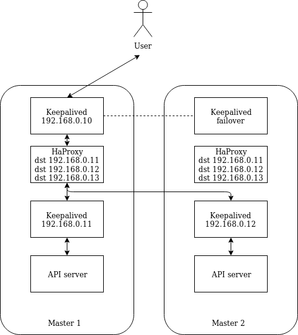

# Fixed IPs

This option relies on the fact that the load balancing software use healtcheck
probes to determine whether a host is healthy. In this option, a certain amount
of IP addresses are reserved for control plane nodes beforehand (for example
192.168.0.11 - 192.168.0.18 out of the 192.168.0.0/24 CIDR). The API endpoint is
also an IP from this CIDR : 192.168.0.10 .

All control plane nodes have a keepalived instance to synchronize the API
endpoint IP. They also all have an instance of HAProxy configured to balance the
traffic between all control plane IP addresses. Each control plane node also
has a specific keepalived instance with the dedicated node IP address. Hence
each control plane node will have an IP address configured either statically or
by DHCP (for example 192.168.0.22), an address from the control plane address
pool set with keepalived or statically configured in which case this is the only
node IP address (for example 192.168.0.12), and an
IP address that is shared between all control plane nodes that is the api
endpoint (192.168.0.10).

When deploying the target cluster, the deployment of the LB (for example
HAProxy) and Keepalived would be done through the cloud-init configuration. The
load balancer configuration would be identical for all control plane nodes, but
the keepalived configuration would be specific for each node if needed (i.e. the
ip address configured on the control plane node is not from the control plane
pool)



Below is an example configuration for Keepalived and HAProxy.

/etc/keepalived/keepalived.conf

```text
! Configuration File for keepalived
global_defs {
 notification_email {
 sysadmin@example.com
 support@example.com
 }
 notification_email_from lb@example.com
 smtp_server localhost
 smtp_connect_timeout 30
}
vrrp_instance VI_1 {
 state MASTER
 interface <iface>
 virtual_router_id 1
 priority 101
 advert_int 1
 virtual_ipaddress {
   <vip>
 }
}
vrrp_instance VI_2 {
 state MASTER
 interface <iface>
 virtual_router_id 2
 priority 101
 advert_int 1
 virtual_ipaddress {
   <vip2>
 }
}
```

`/etc/haproxy/haproxy.cfg`

```text
global
    maxconn 1024
    daemon
    log 127.0.0.1 local0
    ssl-server-verify none

defaults
    log     global
    option redispatch
    option dontlognull
    option http-server-close
    option http-keep-alive
    timeout http-request    5s
    timeout connect         5s
    timeout client          50s
    timeout client-fin      50s
    timeout queue           50s
    timeout server          50s
    timeout server-fin      50s
    timeout tunnel          1h
    timeout http-keep-alive 1m

frontend haproxy_server
    bind <vip>:<vip_port> transparent
    mode tcp
    default_backend kube_apiserver

backend kube_apiserver
    mode tcp
    balance roundrobin
    option tcp-check
    server master-0_api_server <vip2>:<vip2_port> check
```

The last line can be duplicated as many time as you have control plane nodes.
