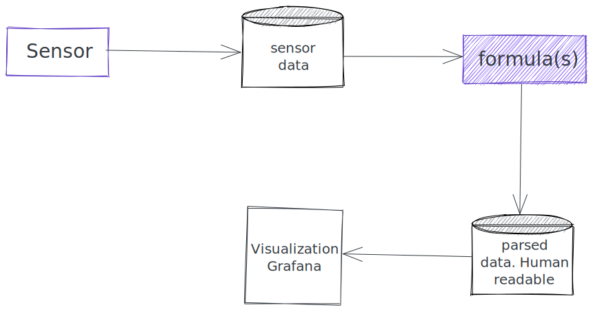

# Power API
 
## What is it

Power API is an open source project maintained by Spirals research group.
It offers software-defined power meters which can measure the power consumption of a
program.

## Power API

Power API is kind of an umbrella of multiple tools, targeting measurement of energy
consumption from different sources. Regardless of which one you use, ensure that the host
you are trying to measure is based on Intel's Sandy Bridge+ processor architecture.

Under the hood Power API is relaying on Inte's Running Average Power Limit(RAPL) to
get power readings.

## Architecture



There are a couple of actors involved in the process.
 - Sensor - collects actual power consumptions from the host
 - Formulas - convert raw data from sensor into human readable format
 - Databases - store sensor and formula data


### RAPL formula

The RAPL formula is designed to measure power consumption of domains (cpu or ram) in real time.
For more info see https://powerapi-ng.github.io/rapl.html#rapl

### Smartwatts

SmartWatts is a software-defined power meter that can estimate the power consumption of software in real-time.
For more info see https://powerapi-ng.github.io/smartwatts.html#smartwatts

### Jouleit

Jouleit can measure power consumption of the CPU, ram and integrated GPU.
For more info see https://powerapi-ng.github.io/jouleit.html#jouleit

### VirtualWatts

VirtualWatts can measure the power consumption of software inside a Virtual Machine (VM) in real-time.
For more info see https://powerapi-ng.github.io/virtualwatts.html#virtualwatts

## How to run it

1. Start mongodb database where we will store sensor data

    ```shell
    docker run -d  --name metrics-db  -p 27888:27017 \
    -e MONGO_INITDB_ROOT_USERNAME=mongoadmin \
    -e MONGO_INITDB_ROOT_PASSWORD=supersecret mongo
    ```

1. Start InfluxDB database for storing formula data

    ```shell
    $ docker run -d --name influx_rapl -p 8086:8086 influxdb:1.8
    ```

3. Start the sensor. We will be running the sensor as docker container but there are some other ways
    also to run it. The sensor script takes config_file_sensor.json as configuration file.

    ```shell 
     $ git clone https://github.com/Nordix/metal3-clusterapi-docs.git
     $ cd powerapi
     $ ./sensor.sh
    ```

3. Start the formula. As an example, we will be using formula_smartwats.sh script to start off
    smartwatts formula. The sensor script takes config_file_smartwats.json as configuration file.
    Make sure that you have updated `"uri": "mongodb://172.17.0.2"` with the correct URI to your
    mongodb instance.

    ```shell 
     $ ./formula_smartwats.sh
    ```

4. At this point, there will be two databases, sensor and formula running. The last step is to visualize
    the data. For that we can use Grafana, which is easy to integrate since it has built in InfluxDB support.
    For more info how to point your Grafana instance to read the data from InfluxDB, check out https://powerapi-ng.github.io/grafana.html


## References:

- [Publications](http://powerapi.org/)
- [Mailing list](sympa@inria.fr)
- [GitHub repo](https://github.com/powerapi-ng)
