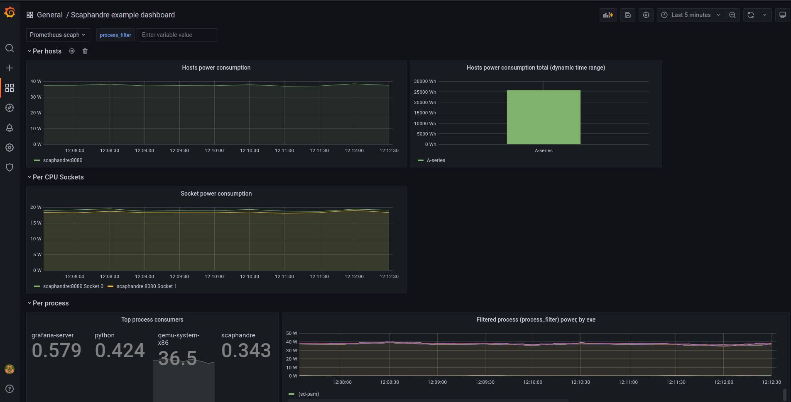
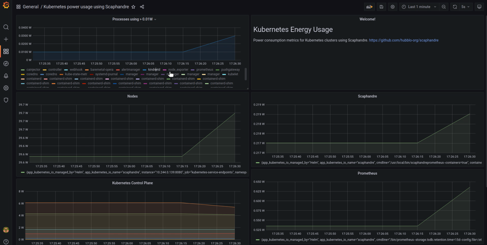
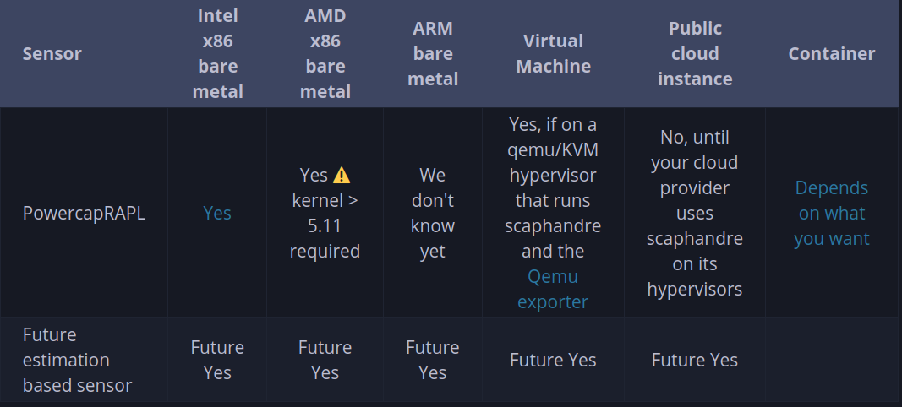

# Scaphandre

Scaphandre is a monitoring agent, dedicated to energy consumption metrics. Its
purpose is to help measuring and thus understanding tech services energy
consumption patterns. This is key, in our opinion, to enable the tech industry
to shift towards more sustainability.
Features it provides include:

- measuring power consumption on **bare metal hosts**
- measuring power consumption of **qemu/kvm virtual machines** from the host
- **exposing** power consumption metrics of a virtual machine, to allow
  **manipulating those metrics in the VM** as if it was a bare metal machine
  (relies on hypervisor features)
- exposing power consumption metrics as a
  **[prometheus](https://prometheus.io) (HTTP) exporter**
- sending power consumption metrics to **[riemann](http://riemann.io/)**
- sending power consumption metrics to **[Warp10](http://warp10.io/)**
- works on **[kubernetes](https://kubernetes.io/)**
- storing power consumption metrics in a **JSON** file
- showing basic power consumption metrics **in the terminal**

## How scaphandre computes per process power consumption

Scaphandre is a tool that makes it possible to see the power being used by a
single process on a computer. More info available
[here](https://hubblo-org.github.io/scaphandre-documentation/explanations/how-scaph-computes-per-process-power-consumption.html).

## Internal Structure

Scaphandre is designed to be extensible. As it performs basically two tasks:
collecting/pre-computing the power consumption metrics and shipping it, and
it is composed of two main components: a sensor and an exporter.

### Sensors

Sensors are expected to:

- get the power consumptions metrics of the host
- make it available for the exporter

The PowercapRAPL for instance, gets and transforms metrics coming from the
powercap Linux kernel module, that serves as an interface to get the data from
the RAPL feature of x86 CPUs.

### Exporters

An exporter is expected to:

- ask the sensors to get new metrics and store them for later, potential usage
- export the current metrics

The Stdout exporter exposes the metrics on the standard output (in your terminal).
The prometheus exporter exposes the metrics on an http endpoint, to be scraped
by a prometheus instance.

More info about insternal structure is available
[here](https://hubblo-org.github.io/scaphandre-documentation/explanations/internal-structure.html).

## How to use it

Before getting started, you need to modprobe the module intel_rapl or
intel_rapl_common first on the host machine:

```bash
modprobe intel_rapl_common # or intel_rapl for kernels < 5
```

In this write up, we will cover running the Scaphandre project using 3 different
options:

1. running Scaphandre using **docker** to measure power consumption of the machine
   (to quickly check it from your terminal)
1. running Scaphandre using ready-made **docker-compose** in the repository to
	 measure power consumption of the machine
	 (to see the data in a decent visualization tool)
1. running Scaphandre using **Helm** to measure power consumption of the
	 Kubernetes cluster (to install Scaphandre, Prometheus and Grafana)

### Option 1: Run scaphandre using docker

This is the easiest and quickest way to try out the Scaphandre project using
docker. For that, just run:

```shell
docker run -v /sys/class/powercap:/sys/class/powercap -v /proc:/proc -ti \
  hubblo/scaphandre stdout -t 15
```

You should get an output like:

```
------------------------------------------------------------

Host:	36.205597 W
	package 	core
Socket1	17.956669 W |	5.166899 W
Socket0	18.259996 W |	5.351316 W

Top 5 consumers:
Power		PID	Exe
34.067745 W	1502751	"qemu-system-x86"
0.275852 W	215	"ksmd"
0.137926 W	1211	"containerd"
0.137926 W	1274	"lldpd"
0 W	1	"systemd"
------------------------------------------------------------

```

Let's briefly describe what you see here. First line is the power consumption of
the machine (between the two last measurements). Second and third lines are the
power consumption of the first and second CPU sockets plus the detail by RAPL
Domain. If you have more than two CPU Sockets, you'll have multiple SocketX lines.
Then you have the 5 processes consuming the most power during the last two
measurements.

### Option 2: Run a complete stack with docker-compose

If you'd like to try scaphandre and see the data in a decent visualization tool,
then you can use a docker-compose in the repository to install scaphandre along
side with prometheus and grafana. Steps are:

Clone the scaphandre project, change the directory to docker-compose folder and
run the compose file:

```shell
git clone https://github.com/hubblo-org/scaphandre.git
cd scaphandre/docker-compose/
docker-compose up -d
```

**Hint:** If you run into a problem of running docker-compose, i.e:

```bash
ImportError: cannot import name 'IPAMConfig' from 'docker.types'
(/usr/local/lib/python3.8/dist-packages/docker/types/__init__.py)
```

run below command (uninstall docker-py with pip) to resolve it:

```shell
sudo pip uninstall docker-py
```

Grafana will be available at <http://localhost:3000>, the default username is
*admin* and the password is *secret*. Example dashboard looks like as below:



To remove the stack just run below command in the same folder:

```shell
docker-compose down
```

### Option 3: Run complete stack inside the Kubernetes cluster using Helm

To be able to measure power consumption of Kubernetes cluster, we used
metal3-dev-env repository to deploy a cluster with single controlplane and
worker along with few pods. More information on how to run a cluster using
m3-dev-env can be found [here](https://github.com/metal3-io/metal3-dev-env#readme).
Please note, you can use any K8s cluster to try this option, i.e using kind or minikube.

Also, if not installed, Helm needs to be installed depending on the OS flavor of
the machine. For that, you can follow the instructions on this
[page](https://helm.sh/docs/intro/install/).

Once we have cluster up and running and Helm in place, run the following commands
in the same order:

#### Install Scaphandre

First we install Scaphandre which runs as a daemon set which creates a pod on
each node for collecting the metrics.

```shell
cd scaphandre
helm install scaphandre helm/scaphandre
```

#### Install Prometheus

Next we will install Prometheus which will scrape the metrics generated by Scaphandre.

```shell
helm repo add prometheus-community https://prometheus-community.github.io/helm-charts
helm repo add kube-state-metrics https://kubernetes.github.io/kube-state-metrics
helm repo update

helm install prometheus prometheus-community/prometheus \
--set alertmanager.persistentVolume.enabled=false \
--set server.persistentVolume.enabled=false
```

This setup should only be used for testing as the Prometheus data is not
persisted if the pods are deleted.

You can access the Prometheus web UI by creating a port forwarding connection.

```shell
kubectl port-forward deploy/prometheus-server 9090:9090
```

**Hint:** If you need to expose specific ports/localhost to the world, you can
check localtunnel for more [guidance](https://github.com/localtunnel/localtunnel).

#### Install Grafana

Create a configmap to store the Grafana dashboard.

```shell
kubectl create configmap scaphandre-dashboard \
    --from-file=scaphandre-dashboard.json=docs_src/tutorials/grafana-kubernetes-dashboard.json
```

Install Grafana.

```shell
helm repo add grafana https://grafana.github.io/helm-charts
helm repo update

helm install grafana grafana/grafana --values docs_src/tutorials/grafana-helm-values.yaml
```

Get the Grafana web UI password which is randomly generated using

```shell
kubectl get secret grafana -o jsonpath="{.data.admin-password}" | base64 --decode
```

and save the output, in order to access the Grafana browser in the next step.

Create a port forwarding connection to the Grafana pod.

```shell
kubectl port-forward deploy/grafana 3000:3000
```

Open Grafana in your browser at <http://localhost:3000> the username is *admin*.
Example Grafana dashboard looks like as below:



#### Cleaning up

Deleting the Helm releases will remove all the resources we created.

```shell
helm delete grafana prometheus scaphandre
```

## Compatibility

Scaphandre intends to provide multiple ways to gather power consumption metrics
and make understanding tech services footprint possible in many situations.
Depending on how you use scaph, you may have some restrictions.

The PowercapRAPL sensor enables you to measure the power consumption, it is the
most precise solution, but it doesn't work in all contexts. A future sensor is
to be developed to support other use cases. Here is the current state of
scaphandre's compatibility:



## References

- [Scaphandre github repo](https://github.com/hubblo-org/scaphandre)
- [Documentation](https://hubblo-org.github.io/scaphandre-documentation/index.html)
