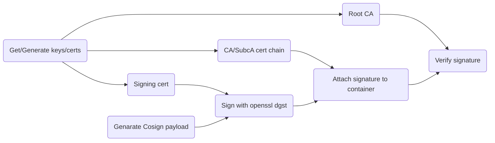

<!-- cSpell:ignore oras,kyverno,airgap,rsassa,pkcs,sigstore,fulcio -->

# Cosign POC

This POC aims to provide a Proof-of-Concept for using cosign to sign/verify
container images using external signing service.

Following chart explains the key/certificate usage in this POC. This POC is
however built to facilitate getting the signature from external signer, and thus
you obtain all certs and signature from them, and do not sign anything yourself.
It is complemented by the [Kyverno](../kyverno/README.md) parts to achieve full
e2e POC.



**References:**

1. [Cosign container signature spec](https://github.com/sigstore/cosign/blob/main/specs/SIGNATURE_SPEC.md)
is a must read.
1. [Fulcio IOD spec](https://github.com/sigstore/fulcio/blob/main/docs/oid-info.md)
1. [Someone else doing the ~same](https://github.com/mvazquezc/mvazquezc.github.io/blob/85f301c3c3b8576a599e03470a3a76c600d6a586/content/posts/2024-04-25-signing-verifying-container-images-with-cosign/index.md)

## Preparation

NOTE: all this is done by `make test`, this is just explaining what it does.

1. Verify basic tools exist

   We need three tools installed and available in PATH:

   - docker
   - cosign
   - openssl

1. Run local registry where we can upload images and signatures

   Commonly, `docker run -d --restart=always -p 127.0.0.1:5003:5000 registry:2`
   does the trick.

1. Push public alpine image to a local registry for testing

   ```sh
   docker pull alpine:3.20.3
   docker tag alpine:3.20.3 127.0.0.1:5003/alpine:3.20.3
   docker push 127.0.0.1:5003/alpine:3.20.3
   ```

1. Generate certificates for signing. We generate CA, sub-CA and leaf.

   ```sh
   ./gencrt.sh
   ```

## Signing

1. Generate payload for local image for signing

   ```sh
   cosign generate 127.0.0.1:5003/alpine:3.20.3 > examples/payload.json
   ```

   The file `examples/payload.json` is simple:

   ```json
   {
      "critical": {
         "identity": {
            "docker-reference": "127.0.0.1:5003/alpine"
         },
         "image": {
            "docker-manifest-digest": "sha256:33735bd63cf84d7e388d9f6d297d348c523c044410f553bd878c6d7829612735"
         },
         "type": "cosign container image signature"
      },
      "optional": null
   }
   ```

1. Sign it and convert to base64

   SHA512 with PSS padding is the wanted state. Note that it DOES NOT WORK
   without cosign patch. IN PROGRESS.

   ```sh
   # Sign the payload with SHA256 - ONLY ONE THAT WORKS BY DEFAULT
   openssl dgst -sha256 -sign keys/leaf.key \
      -out examples/payload.sig examples/payload.json
   base64 examples/payload.sig > examples/payloadbase64.sig
   ```

   The content of the file `examples/payloadbase64.sig` looks like following:

   ```console
   MEUCIQDfcf0R+9nNACTQVxsXmlWXavKXWwCQuknLFbzknDRzkgIgVPLD7NUquGlJ+sQHQFziujKv
   T1Zck4v6ZOG4LeLonKU=
   ```

   Signatures are binary, and thus base64 encoded.

1. Upload signature to the registry, and attach signing cert and certificate
   chain to it.

   ```sh
   cosign attach signature \
      --payload examples/payload.json \
      --certificate examples/leaf.crt \
      --certificate-chain examples/certificate_chain.pem \
      --signature examples/payloadbase64.sig \
      127.0.0.1:5000/alpine:3.20.3
   ```

## Verifying

We need to verify with cosign. Note that SHA512/PSS do not work without patch.

For flags, we need to ignore the identity/issuer with regex `.*`.
We also need to ignore SCT. `--private-infrastructure` avoids transparency log
queries, so no `--insecure-ignore-tlog` needed.

We don't need to give signing cert nor cert chain, as they're attached to
signature in the registry. We only pass `--ca-roots` pointing to our CA cert.

```sh
cosign verify \
    --ca-roots=examples/ca.crt \
    --certificate-identity-regexp '.*' \
    --certificate-oidc-issuer-regexp '.*' \
    --private-infrastructure \
    --insecure-ignore-sct \
    "127.0.0.1:5003/alpine:3.20.3"
```

Which will succeed with some disclaimers:

```console
Verification for 127.0.0.1:5003/alpine@sha256:33735bd63cf84d7e388d9f6d297d348c523c044410f553bd878c6d7829612735 --
The following checks were performed on each of these signatures:
  - The cosign claims were validated
  - The code-signing certificate was verified using trusted certificate authority certificates

[{"critical":{"identity":{"docker-reference":"127.0.0.1:5003/alpine"},"image":{"docker-manifest-digest":"sha256:33735bd63cf84d7e388d9f6d297d348c523c044410f553bd878c6d7829612735"},"type":"cosign container image signature"},"optional":{"Subject":"https://signing.example.com"}}]
```

## Exporting and importing

Cosign can be used to export and import images with signatures, without need for
external tools like [Oras](../oras/README.md).

- `make pack` calls `cosign save ...` and tarballs the OCI layer dump.
- `make unpack` unpacks the tarball, and `cosign load ...` it back into registry.

## Cosign signing algorithm support

Sigstore/Cosign community does not what SHA512/PSS support unless it is covering
their entire ecosystem. See [summary](https://github.com/sigstore/cosign/pull/3917#issuecomment-2451334036)
in this issue.

Some references:

- [Issue from 2022 for allowing configurability](https://github.com/sigstore/cosign/issues/1775)
- [Add --signing-algorithm flag PR](https://github.com/sigstore/cosign/pull/3497)
- [Simple PSS/SHA512 support PR for verify](https://github.com/sigstore/cosign/pull/3917)
- [Slack discussion about it](https://sigstore.slack.com/archives/C01PZKDL4DP/p1730288293793379)
