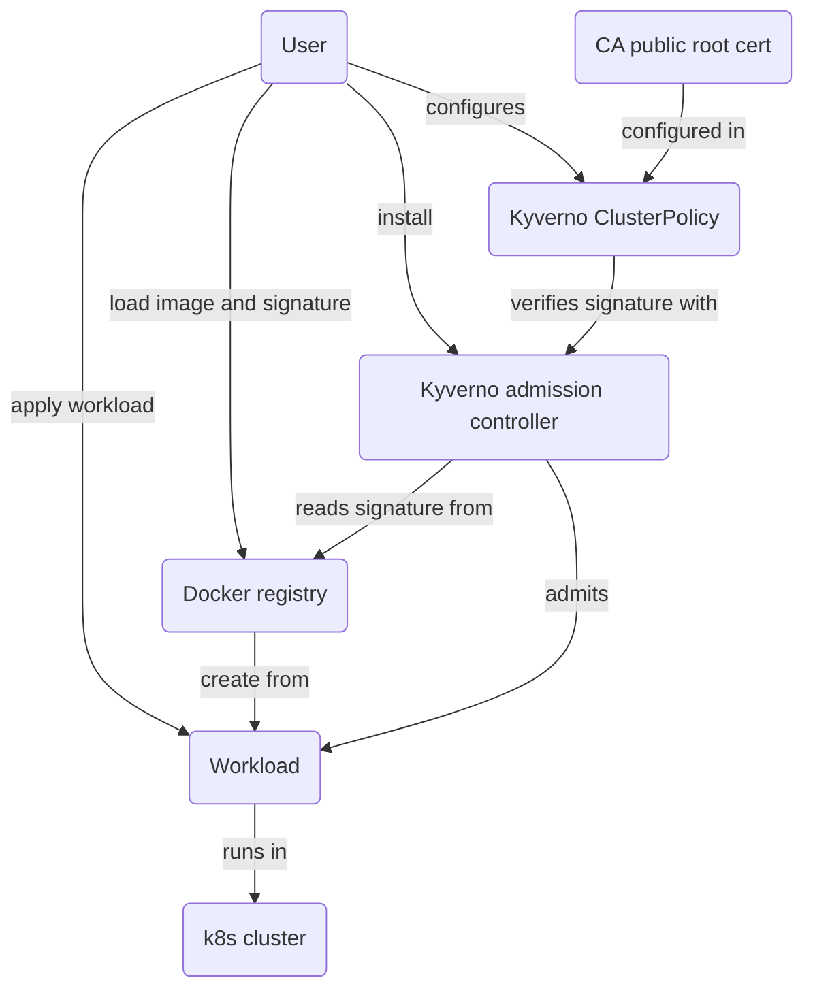

<!-- markdownlint-disable line-length -->
<!-- cSpell:ignore kyverno -->

# Image signature verification

Verifying image signatures runtime using Notation or Cosign, and Kyverno.



## Non-runtime verification

Verifying signatures with Notation "offline", please see
[Notation External Signer documentation](../notation/README.md).

Verifying signatures with Cosign "offline", please see
[Cosign documentation](../cosign/README.md).

## Runtime verification

For runtime signature verification, we use
[Kyverno with Notation](https://kyverno.io/docs/writing-policies/verify-images/notary/),
or [Kyverno with Cosign](https://kyverno.io/docs/writing-policies/verify-images/sigstore/)

`make test` tests the full setup with Kind cluster, local
registry, Notation external signer plugin, or Cosign. `make clean` to remove
everything.

Run `make` to get all meaningful make targets, and check the Makefile itself
for all targets.

### Steps explained

1. Run Kind cluster with [local registry](https://kind.sigs.k8s.io/docs/user/local-registry/)

   ```bash
   ./scripts/kind-cluster.sh
   ```

1. Load images for testing

   ```bash
   # load busybox 1.36.1-glibc image for testing, signed
   docker pull busybox:1.36.1-glibc
   docker tag busybox:1.36.1-glibc 127.0.0.1:5001/busybox:1.36.1-glibc
   docker push 127.0.0.1:5001/busybox:1.36.1-glibc

   # load busybox 1.36.0-glibc image for testing, not signed
   docker pull busybox:1.36.0-glibc
   docker tag busybox:1.36.0-glibc 127.0.0.1:5001/busybox:1.36.0-glibc
   docker push 127.0.0.1:5001/busybox:1.36.0-glibc
   ```

1. Sign image with Notation or Cosign

   Sign image with Notation and Custom plugin. [See here](../notation/README.md).

   ```bash
   # notation
   $ make certificates
   $ export EXTERNAL_CERT_CHAIN=$(pwd)/examples/certificate_chain.pem
   $ export EXTERNAL_PRIVATE_KEY=$(pwd)/examples/leaf.key
   $ export EXTERNAL_SIGNER=../notation/examples/rsassa-pss-sha512.sh
   $ notation sign --insecure-registry --id "anything" --plugin "external-signer" 127.0.0.1:5001/busybox@sha256:d319b0e3e1745e504544e931cde012fc5470eba649acc8a7b3607402942e5db7
   Successfully signed 127.0.0.1:5001/busybox@sha256:d319b0e3e1745e504544e931cde012fc5470eba649acc8a7b3607402942e5db7

   # cosign
   $ make certificates
   $ cosign generate 127.0.0.1:5003/alpine:3.20.3 > examples/payload.json
   $ openssl dgst -sha256 -sign examples/leaf.key \
      -out examples/payload.sig examples/payload.json
   $ base64 examples/payload.sig > examples/payloadbase64.sig
   $ cosign attach signature \
      --payload examples/payload.json \
      --signature examples/payloadbase64.sig \
      127.0.0.1:5003/alpine:3.20.3
   ```

   When finished, you should be able to inspect the signatures.

   ```bash
   # notation
   $ notation inspect 127.0.0.1:5001/busybox@sha256:d319b0e3e1745e504544e931cde012fc5470eba649acc8a7b3607402942e5db7
   ...
   $ cosign tree 127.0.0.1:5003/alpine:3.20.3
   ...
   ```

1. Run Kyverno

   If you don't have Helm installed, see
   [here](https://helm.sh/docs/intro/install/).

   ```bash
   helm repo add kyverno https://kyverno.github.io/kyverno/
   helm repo update
   # check available versions and configurations
   helm search repo kyverno -l
   # install suitable one
   helm install kyverno kyverno/kyverno -n kyverno --create-namespace
   # NOTE: we need to edit Kyverno config to allow insecure registries
   kubectl -n kyverno edit deployment kyverno-admission-controller
   # change --allowInsecureRegistry=false to true
   ```

1. Add Kyverno policy for image signatures

   ```bash
   # NOTE: this has CA cert you need to replace with your signing CA cert
   # NOTE: in Kind, the local registry is running as 172.18.0.2:5000
   kubectl apply -n kyverno -f examples/kyverno-policy-{notation,cosign}.yaml
   ```

1. Test the policy with Pod

   ```bash
   # signed busybox will pass
   $ kubectl run test --image=172.19.0.3:5000/busybox:1.36.1-glibc --dry-run=server
   pod/test created (server dry run)
   ```

   with following logging in Kyverno admission controller:

   ```console
   I0206 13:39:12.390636       1 event_broadcaster.go:338] "Event occurred" object="check-image-notary" kind="ClusterPolicy" apiVersion="kyverno.io/v1" type="Warning" reason="PolicyViolation" action="Resource Blocked" note="Pod default/test: [verify-signature-notary] fail (blocked); failed to verify image 172.19.0.3:5000/busybox@sha256:086417a48026173aaadca4ce43a1e4b385e8e62cc738ba79fc6637049674cac0: .attestors[0].entries[0]: failed to parse image reference: 172.19.0.3:5000/busybox@sha256:086417a48026173aaadca4ce43a1e4b385e8e62cc738ba79fc6637049674cac0: HEAD http://172.19.0.3:5000/v2/busybox/manifests/sha256:086417a48026173aaadca4ce43a1e4b385e8e62cc738ba79fc6637049674cac0: unexpected status code 404 Not Found (HEAD responses have no body, use GET for details)"
   I0206 13:41:31.383870       1 imageverifier.go:261] "cache entry found" logger="engine.verify" policy.name="check-image-notary" policy.namespace="" policy.apply="All" new.kind="Pod" new.namespace="default" new.name="test" rule.name="verify-signature-notary" namespace="" policy="check-image-notary" ruleName="verify-signature-notary" imageRef="172.19.0.3:5000/busybox:1.36.1-glibc"
   I0206 13:41:31.389427       1 event_broadcaster.go:338] "Event occurred" object="check-image-notary" kind="ClusterPolicy" apiVersion="kyverno.io/v1" type="Normal" reason="PolicyApplied" action="Resource Passed" note="Pod default/test: pass"
   I0206 13:41:31.396586       1 validation.go:108] "validation passed" logger="webhooks.resource.validate" gvk="/v1, Kind=Pod" gvr={"group":"","version":"v1","resource":"pods"} namespace="default" name="test" operation="CREATE" uid="dd4f5ed5-dd0b-46d8-8b5c-642f4ae97857" user={"username":"kubernetes-admin","groups":["system:masters","system:authenticated"]} roles=null clusterroles=["cluster-admin","system:basic-user","system:discovery","system:public-info-viewer"] resource.gvk="/v1, Kind=Pod" kind="Pod" action="validate" resource="default/Pod/test" operation="CREATE" gvk="/v1, Kind=Pod" policy="check-image-notary"
   I0206 13:41:31.396703       1 event_broadcaster.go:338] "Event occurred" object="check-image-notary" kind="ClusterPolicy" apiVersion="kyverno.io/v1" type="Normal" reason="PolicyApplied" action="Resource Passed" note="Pod default/test: pass"
   ```

   ```bash
   # non-signed busybox will not pass
   $ kubectl run test --image=172.19.0.3:5000/busybox:1.36.0-glibc --dry-run=server
   Error from server: admission webhook "mutate.kyverno.svc-fail" denied the request:

   resource Pod/default/test was blocked due to the following policies

   check-image-notary:
     verify-signature-notary: 'failed to verify image 172.19.0.3:5000/busybox:1.36.0-glibc:
       .attestors[0].entries[0]: failed to verify 172.19.0.3:5000/busybox@sha256:086417a48026173aaadca4ce43a1e4b385e8e62cc738ba79fc6637049674cac0:
       no signature is associated with "172.19.0.3:5000/busybox@sha256:086417a48026173aaadca4ce43a1e4b385e8e62cc738ba79fc6637049674cac0",
       make sure the artifact was signed successfully'

   ```

   with following logging in Kyverno admission controller:

   ```console
   I0206 13:41:41.401723       1 imageverifier.go:265] "cache entry not found" logger="engine.verify" policy.name="check-image-notary" policy.namespace="" policy.apply="All" new.kind="Pod" new.namespace="default" new.name="test" rule.name="verify-signature-notary" namespace="" policy="check-image-notary" ruleName="verify-signature-notary" imageRef="172.19.0.3:5000/busybox:1.36.0-glibc"
   I0206 13:41:41.401737       1 imageverifier.go:321] "verifying image signatures" logger="engine.verify" policy.name="check-image-notary" policy.namespace="" policy.apply="All" new.kind="Pod" new.namespace="default" new.name="test" rule.name="verify-signature-notary" image="172.19.0.3:5000/busybox:1.36.0-glibc" attestors=1 attestations=0
   I0206 13:41:41.401911       1 notary.go:44] "verifying image" logger="Notary" reference="172.19.0.3:5000/busybox:1.36.0-glibc"
   I0206 13:41:41.407184       1 imageverifier.go:498] "image attestors verification failed" logger="engine.verify" policy.name="check-image-notary" policy.namespace="" policy.apply="All" new.kind="Pod" new.namespace="default" new.name="test" rule.name="verify-signature-notary" verifiedCount=0 requiredCount=1 errors=".attestors[0].entries[0]: failed to verify 172.19.0.3:5000/busybox@sha256:086417a48026173aaadca4ce43a1e4b385e8e62cc738ba79fc6637049674cac0: no signature is associated with \"172.19.0.3:5000/busybox@sha256:086417a48026173aaadca4ce43a1e4b385e8e62cc738ba79fc6637049674cac0\", make sure the artifact was signed successfully"
   E0206 13:41:41.407214       1 imageverifier.go:360] "failed to verify image" err=".attestors[0].entries[0]: failed to verify 172.19.0.3:5000/busybox@sha256:086417a48026173aaadca4ce43a1e4b385e8e62cc738ba79fc6637049674cac0: no signature is associated with \"172.19.0.3:5000/busybox@sha256:086417a48026173aaadca4ce43a1e4b385e8e62cc738ba79fc6637049674cac0\", make sure the artifact was signed successfully" logger="engine.verify" policy.name="check-image-notary" policy.namespace="" policy.apply="All" new.kind="Pod" new.namespace="default" new.name="test" rule.name="verify-signature-notary"
   I0206 13:41:41.413149       1 block.go:29] "blocking admission request" logger="webhooks.resource.mutate" gvk="/v1, Kind=Pod" gvr={"group":"","version":"v1","resource":"pods"} namespace="default" name="test" operation="CREATE" uid="428db8d9-9268-4fef-916f-6d0d653f2843" user={"username":"kubernetes-admin","groups":["system:masters","system:authenticated"]} roles=null clusterroles=["cluster-admin","system:basic-user","system:discovery","system:public-info-viewer"] resource.gvk="/v1, Kind=Pod" kind="Pod" policy="check-image-notary"
   E0206 13:41:41.413203       1 handlers.go:173] "image verification failed" err=<
   ```

1. Test the policy with Deployment

Same as with Pod, the failure is immediate, and not delayed until the Pod would
created by the Deployment.

Unsigned image:

```shell
$ kubectl create deployment --image 172.19.0.3:5000/busybox:1.36.0-glibc busybox
error: failed to create deployment: admission webhook "mutate.kyverno.svc-fail" denied the request:

resource Deployment/default/busybox was blocked due to the following policies

check-image-notary:
  autogen-verify-signature-notary: 'failed to verify image 172.19.0.3:5000/busybox:1.36.0-glibc:
    .attestors[0].entries[0]: failed to verify 172.19.0.3:5000/busybox@sha256:086417a48026173aaadca4ce43a1e4b385e8e62cc738ba79fc6637049674cac0:
    no signature is associated with "172.19.0.3:5000/busybox@sha256:086417a48026173aaadca4ce43a1e4b385e8e62cc738ba79fc6637049674cac0",
    make sure the artifact was signed successfully'
```

Kyverno logs with failure:

```console
I0213 10:03:30.428913       1 event_broadcaster.go:338] "Event occurred" object="check-image-notary" kind="ClusterPolicy" apiVersion="kyverno.io/v1" type="Warning" reason="PolicyViolation" action="Resource Blocked" note="Deployment default/busybox: [autogen-verify-signature-notary] fail (blocked); failed to verify image 172.19.0.3:5000/busybox:1.36.1-glibc: .attestors[0].entries[0]: failed to parse image reference: 172.19.0.3:5000/busybox:1.36.1-glibc: HEAD http://172.19.0.3:5000/v2/busybox/manifests/1.36.1-glibc: unexpected status code 404 Not Found (HEAD responses have no body, use GET for details)"
I0213 10:03:30.428937       1 event_broadcaster.go:338] "Event occurred" object="check-image-notary" kind="ClusterPolicy" apiVersion="kyverno.io/v1" type="Warning" reason="PolicyViolation" action="Resource Blocked" note="Deployment default/busybox: [autogen-verify-signature-notary] error (blocked); failed to update digest: failed to fetch image reference: 172.19.0.3:5000/busybox:1.36.1-glibc, error: GET http://172.19.0.3:5000/v2/busybox/manifests/1.36.1-glibc: MANIFEST_UNKNOWN: manifest unknown; map[Tag:1.36.1-glibc]"
I0213 10:06:16.332751       1 imageverifier.go:265] "cache entry not found" logger="engine.verify" policy.name="check-image-notary" policy.namespace="" policy.apply="All" new.kind="Deployment" new.namespace="default" new.name="busybox" rule.name="autogen-verify-signature-notary" namespace="" policy="check-image-notary" ruleName="autogen-verify-signature-notary" imageRef="172.19.0.3:5000/busybox:1.36.0-glibc"
I0213 10:06:16.332771       1 imageverifier.go:321] "verifying image signatures" logger="engine.verify" policy.name="check-image-notary" policy.namespace="" policy.apply="All" new.kind="Deployment" new.namespace="default" new.name="busybox" rule.name="autogen-verify-signature-notary" image="172.19.0.3:5000/busybox:1.36.0-glibc" attestors=1 attestations=0
I0213 10:06:16.332989       1 notary.go:44] "verifying image" logger="Notary" reference="172.19.0.3:5000/busybox:1.36.0-glibc"
I0213 10:06:16.339005       1 imageverifier.go:498] "image attestors verification failed" logger="engine.verify" policy.name="check-image-notary" policy.namespace="" policy.apply="All" new.kind="Deployment" new.namespace="default" new.name="busybox" rule.name="autogen-verify-signature-notary" verifiedCount=0 requiredCount=1 errors=".attestors[0].entries[0]: failed to verify 172.19.0.3:5000/busybox@sha256:086417a48026173aaadca4ce43a1e4b385e8e62cc738ba79fc6637049674cac0: no signature is associated with \"172.19.0.3:5000/busybox@sha256:086417a48026173aaadca4ce43a1e4b385e8e62cc738ba79fc6637049674cac0\", make sure the artifact was signed successfully"
E0213 10:06:16.339030       1 imageverifier.go:360] "failed to verify image" err=".attestors[0].entries[0]: failed to verify 172.19.0.3:5000/busybox@sha256:086417a48026173aaadca4ce43a1e4b385e8e62cc738ba79fc6637049674cac0: no signature is associated with \"172.19.0.3:5000/busybox@sha256:086417a48026173aaadca4ce43a1e4b385e8e62cc738ba79fc6637049674cac0\", make sure the artifact was signed successfully" logger="engine.verify" policy.name="check-image-notary" policy.namespace="" policy.apply="All" new.kind="Deployment" new.namespace="default" new.name="busybox" rule.name="autogen-verify-signature-notary"
I0213 10:06:16.343496       1 block.go:29] "blocking admission request" logger="webhooks.resource.mutate" gvk="apps/v1, Kind=Deployment" gvr={"group":"apps","version":"v1","resource":"deployments"} namespace="default" name="busybox" operation="CREATE" uid="217365f6-cf1d-4249-8eff-1a1743f17866" user={"username":"kubernetes-admin","groups":["system:masters","system:authenticated"]} roles=null clusterroles=["cluster-admin","system:basic-user","system:discovery","system:public-info-viewer"] resource.gvk="apps/v1, Kind=Deployment" kind="Deployment" policy="check-image-notary"
E0213 10:06:16.343577       1 handlers.go:173] "image verification failed" err=<


    resource Deployment/default/busybox was blocked due to the following policies

    check-image-notary:
      autogen-verify-signature-notary: 'failed to verify image 172.19.0.3:5000/busybox:1.36.0-glibc:
        .attestors[0].entries[0]: failed to verify 172.19.0.3:5000/busybox@sha256:086417a48026173aaadca4ce43a1e4b385e8e62cc738ba79fc6637049674cac0:
        no signature is associated with "172.19.0.3:5000/busybox@sha256:086417a48026173aaadca4ce43a1e4b385e8e62cc738ba79fc6637049674cac0",
        make sure the artifact was signed successfully'
 > logger="webhooks.resource.mutate" gvk="apps/v1, Kind=Deployment" gvr={"group":"apps","version":"v1","resource":"deployments"} namespace="default" name="busybox" operation="CREATE" uid="217365f6-cf1d-4249-8eff-1a1743f17866" user={"username":"kubernetes-admin","groups":["system:masters","system:authenticated"]} roles=null clusterroles=["cluster-admin","system:basic-user","system:discovery","system:public-info-viewer"] resource.gvk="apps/v1, Kind=Deployment" kind="Deployment"
```

Signed image:

```shell
$ kubectl create deployment  --image 172.19.0.3:5000/busybox:1.36.1-glibc busybox
deployment.apps/busybox created
```

Kyverno logs with success:

```console
I0213 10:06:22.364263       1 event_broadcaster.go:338] "Event occurred" object="check-image-notary" kind="ClusterPolicy" apiVersion="kyverno.io/v1" type="Normal" reason="PolicyApplied" action="Resource Passed" note="Deployment default/busybox: pass"
I0213 10:06:22.364075       1 validation.go:108] "validation passed" logger="webhooks.resource.validate" gvk="apps/v1, Kind=Deployment" gvr={"group":"apps","version":"v1","resource":"deployments"} namespace="default" name="busybox" operation="CREATE" uid="39d07ca8-928c-4fec-95e5-8b50e583a741" user={"username":"kubernetes-admin","groups":["system:masters","system:authenticated"]} roles=null clusterroles=["cluster-admin","system:basic-user","system:discovery","system:public-info-viewer"] resource.gvk="apps/v1, Kind=Deployment" kind="Deployment" action="validate" resource="default/Deployment/busybox" operation="CREATE" gvk="apps/v1, Kind=Deployment" policy="check-image-notary"
I0213 10:06:22.405312       1 imageverifier.go:265] "cache entry not found" logger="engine.verify" policy.name="check-image-notary" policy.namespace="" policy.apply="All" new.kind="Pod" new.namespace="default" new.name="" rule.name="verify-signature-notary" namespace="" policy="check-image-notary" ruleName="verify-signature-notary" imageRef="172.19.0.3:5000/busybox@sha256:d319b0e3e1745e504544e931cde012fc5470eba649acc8a7b3607402942e5db7"
I0213 10:06:22.405329       1 imageverifier.go:321] "verifying image signatures" logger="engine.verify" policy.name="check-image-notary" policy.namespace="" policy.apply="All" new.kind="Pod" new.namespace="default" new.name="" rule.name="verify-signature-notary" image="172.19.0.3:5000/busybox@sha256:d319b0e3e1745e504544e931cde012fc5470eba649acc8a7b3607402942e5db7" attestors=1 attestations=0
I0213 10:06:22.405639       1 notary.go:44] "verifying image" logger="Notary" reference="172.19.0.3:5000/busybox@sha256:d319b0e3e1745e504544e931cde012fc5470eba649acc8a7b3607402942e5db7"
I0213 10:06:22.416321       1 notary.go:130] "content" logger="Notary" type="application/vnd.cncf.notary.payload.v1+json" data="{\"targetArtifact\":{\"digest\":\"sha256:d319b0e3e1745e504544e931cde012fc5470eba649acc8a7b3607402942e5db7\",\"mediaType\":\"application/vnd.docker.distribution.manifest.v2+json\",\"size\":527}}"
I0213 10:06:22.416337       1 notary.go:81] "verified image" logger="Notary" type="application/vnd.docker.distribution.manifest.v2+json" digest="sha256:d319b0e3e1745e504544e931cde012fc5470eba649acc8a7b3607402942e5db7" size=527
I0213 10:06:22.416346       1 imageverifier.go:489] "image attestors verification succeeded" logger="engine.verify" policy.name="check-image-notary" policy.namespace="" policy.apply="All" new.kind="Pod" new.namespace="default" new.name="" rule.name="verify-signature-notary" verifiedCount=1 requiredCount=1
I0213 10:06:22.421954       1 validation.go:108] "validation passed" logger="webhooks.resource.validate" gvk="/v1, Kind=Pod" gvr={"group":"","version":"v1","resource":"pods"} namespace="default" name="busybox-86f6b9cb-8qsds" operation="CREATE" uid="5a492250-5abb-4866-8c1b-f771e69d5d35" user={"username":"system:serviceaccount:kube-system:replicaset-controller","uid":"0a4d1ed8-be02-4815-872a-3d8e11ca3d4b","groups":["system:serviceaccounts","system:serviceaccounts:kube-system","system:authenticated"]} roles=null clusterroles=["system:basic-user","system:controller:replicaset-controller","system:discovery","system:public-info-viewer","system:service-account-issuer-discovery"] resource.gvk="/v1, Kind=Pod" kind="Pod" action="validate" resource="default/Pod/busybox-86f6b9cb-8qsds" operation="CREATE" gvk="/v1, Kind=Pod" policy="check-image-notary"
I0213 10:06:22.422093       1 event_broadcaster.go:338] "Event occurred" object="check-image-notary" kind="ClusterPolicy" apiVersion="kyverno.io/v1" type="Normal" reason="PolicyApplied" action="Resource Passed" note="Pod default/busybox-86f6b9cb-8qsds: pass"
```

NOTE: the `pod-success` and `deployment-success` pods will show up as
`ImagePullBackoff` as configuring non-localhost Docker registry within
Kind is wonky. This does not mean anything bad in this POC context. Kind
integration with registries is just not set up properly for pulling, even though
the verification of signatures work as expected.

Similar tests can be done with Cosign and `alpine:3.20.3` image (signed) and
`alpine:3.20.2` (unsigned).
