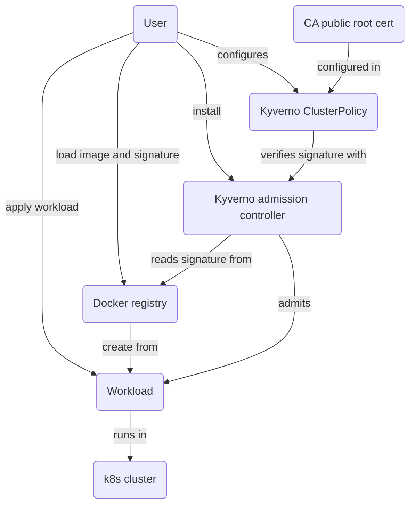

<!-- markdownlint-disable line-length -->
<!-- cSpell:ignore kyverno -->

# Image signature verification

Verifying image signatures runtime using Notation or Cosign, and Kyverno.

## Non-runtime verification

Verifying signatures with Notation "offline", please see
[Notation External Signer documentation](../notation/README.md).

Verifying signatures with Cosign "offline", please see
[Cosign documentation](../cosign/README.md).

## Runtime verification

For runtime signature verification, we use
[Kyverno with Notation](https://kyverno.io/docs/writing-policies/verify-images/notary/),
or [Kyverno with Cosign](https://kyverno.io/docs/writing-policies/verify-images/sigstore/)

This is part of e2e tests, suggested to run via repository top-level `Makefile`
via `make notation` or `make cosign`.

Kyverno's Makefile has `make setup` sets up the full setup with Kind cluster,
local registry. `make -f cosign.mk` will run Cosign tests in this prepared
cluster, while `make -f notation.mk` will run Notation tests.  `make clean` to
remove everything.
