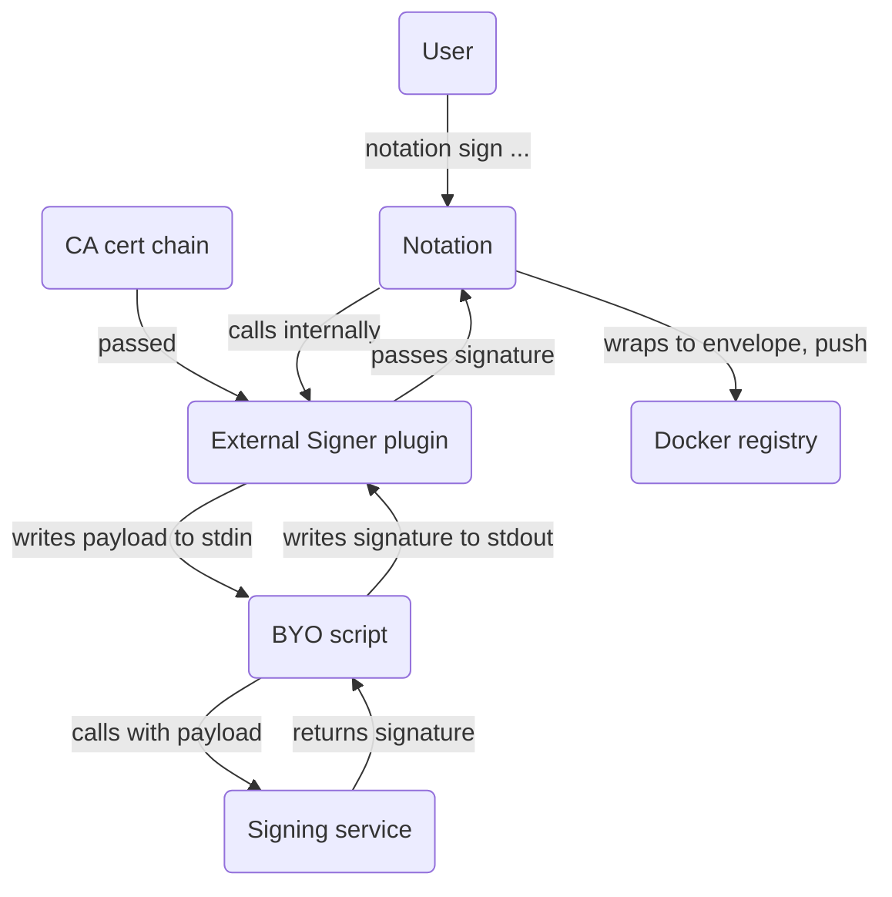

<!-- markdownlint-disable line-length -->
<!-- cSpell:ignore rsassa -->

# External Signer Plugin for Notation

This repository implements a plugin that will call any external signer as in
any external program or script, that will be provided with the payload via
`stdin` and should return raw signature via `stdout`. Additionally the
certificate chain needs to be provided.

This allows implementing custom integration to whatever signing backend, whether
it is a Python script, Bash script, Go executable, or anything you have
available without having to implement the whole thing as Notation Plugin in Go.



## Plugin

This plugin is based on the
[Notation plugin spec](https://github.com/notaryproject/specifications/blob/main/specs/plugin-extensibility.md).

### Building and Installing

Building the plugin is as simple as `make build`.

Install the notation-external-signer to the Notation path specified by Notation
plugin spec. On Unix, the path is
`${XDG_CONFIG_HOME}/notation/plugins/external-signer/notation-external-signer`, ie.
`${HOME}/.config/notation/plugins/external-signer/notation-external-signer`

`make install` will build and install the script into above directory, where it
will be auto-located by Notation.

Run `make` to get all meaningful make targets, and check the Makefile itself
for all targets.

### Usage

Two example scripts are provided in `examples` to test out the plugin.

Expectation for external signer script is that it reads the Notation payload
from the `stdin` and outputs the signature to `stdout`.

In the simplest form of external signer, the signer could can sign the payload
with OpenSSL, emulating importing key to Notation and then signing the artifact.

In more complex form, the script could be talking to any external signer using
their API, which would then sign the payload and return signature to the plugin.

#### Local signing example

This example is doing the same thing as importing the key directly to Notation
and use Notation to do the signing. For signing locally, you need the leaf
key (signing directly with the CA key is not recommended) and the supporting
certificate chain.

You need certificates and certificate chain for the signature:

```bash
# root ca
openssl genrsa -out examples/ca.key 4096
openssl req -new -x509 -days 365 -key examples/ca.key \
    -subj "/O=Notation/CN=Notation Root CA" \
    -out examples/ca.crt -addext "keyUsage=critical,keyCertSign"

# private key and leaf cert
openssl genrsa -out examples/leaf.key 4096
openssl req -newkey rsa:4096 -nodes -keyout examples/leaf.key \
    -subj "/CN=Notation.leaf" -out examples/leaf.csr

openssl x509 -req \
    -extfile <(printf "basicConstraints=critical,CA:FALSE\nkeyUsage=critical,digitalSignature") \
    -days 365 -in examples/leaf.csr -CA examples/ca.crt -CAkey examples/ca.key \
    -CAcreateserial -out examples/leaf.crt

# certificate chain
cat examples/leaf.crt examples/ca.crt > examples/certificate_chain.pem
```

Assuming you have [local Docker registry](https://hub.docker.com/_/registry)
with an image stored there you want signed,
say [busybox:1.36.1-glibc](https://hub.docker.com/_/busybox) with a digest of
`sha256:e046063223f7eaafbfbc026aa3954d9a31b9f1053ba5db04a4f1fdc97abd8963`:

Example: [rsassa-pss-sha512.sh](examples/rsassa-pss-sha512.sh)

```bash
export EXTERNAL_PRIVATE_KEY="$(pwd)/tmp/leaf.key"
export EXTERNAL_CERT_CHAIN="$(pwd)/tmp/certificate_chain.pem"
export EXTERNAL_SIGNER="$(pwd)/examples/rsassa-pss-sha512.sh"
notation sign --insecure-registry --id="anything" --plugin "external-signer" \
    127.0.0.1:5000/busybox@sha256:e046063223f7eaafbfbc026aa3954d9a31b9f1053ba5db04a4f1fdc97abd8963
```

#### Payload and Signature from file example

We need to pass correct
([Notation specific](https://github.com/notaryproject/specifications/blob/main/specs/signature-specification.md#payload))
payload to external services for signing. When signing with
`read-signature-from-file.sh`, the script will save a `payload.txt` that need
to be signed by the service or any manual process you like. Notation plugin
needs to wait during the operation to keep metadata intact.

Information on the payload, which is in base64+base64url double-encoded
[JWS format](https://www.redhat.com/en/blog/jose-json-object-signing-and-encryption).
The payload is delivered as text, and will contain two base64url encoded JSON
objects, concatenated by `.`

For signing the payload, equivalent of command below needs to be executed:

```bash
# payload will be read as-is from stdin, raw signature writted to stdout
openssl dgst -sha512 -sign "${EXTERNAL_PRIVATE_KEY}" \
    -sigopt rsa_padding_mode:pss -sigopt rsa_pss_saltlen:32
```

Example: [read-signature-from-file.sh](examples/read-signature-from-file.sh)

```bash
# expectation is to have "payload.sig" with the raw signature present
export EXTERNAL_CERT_CHAIN="$(pwd)/tmp/certificate_chain.pem"
export EXTERNAL_SIGNER="$(pwd)/examples/read-signature-from-file.sh"
notation sign --insecure-registry --id="foo" --plugin "script" \
    127.0.0.1:5000/busybox@sha256:e046063223f7eaafbfbc026aa3954d9a31b9f1053ba5db04a4f1fdc97abd8963
```

#### Combine the examples

It is possible to combine the two examples.

```bash
export EXTERNAL_SIGNER=$(pwd)/examples/read-signature-from-file.sh
export EXTERNAL_CERT_CHAIN=$(pwd)/examples/certificate_chain.pem
notation sign --insecure-registry --plugin script --id "anything" \
    127.0.0.1:5000/busybox@sha256:d319b0e3e1745e504544e931cde012fc5470eba649acc8a7b3607402942e5db7
# at this point, script has writted payload.txt to disk, and is waiting
# payload.sig to appear... after 60s, execution will continue:
Successfully signed 127.0.0.1:5000/busybox@sha256:d319b0e3e1745e504544e931cde012fc5470eba649acc8a7b3607402942e5db7
```

In another shell:

```bash
cat payload.txt | EXTERNAL_PRIVATE_KEY=$(pwd)/examples/leaf.key \
    ./examples/rsassa-pss-sha512.sh > payload.sig
```

After 60s, the first script will continue and read the signature from disk
and successfully complete the signing.

### Verifying

1. Put the CA into trust store:
   `notation cert add -t ca -s external "examples/ca.crt"`

1. Configure trust policy:

   ```bash
    $ cat <<EOF > ./trustpolicy.json
    {
        "version": "1.0",
        "trustPolicies": [
            {
                "name": "external-signer-policy",
                "registryScopes": [ "*" ],
                "signatureVerification": {
                    "level" : "strict"
                },
                "trustStores": [ "ca:external" ],
                "trustedIdentities": [
                    "*"
                ]
            }
        ]
    }
    EOF
    $ notation policy import ./trustpolicy.json
   ```

1. Verify the artifact:

   ```bash
    # notation verify <myRegistry>/<myRepo>@<digest> -v
    $ notation verify --insecure-registry \
        127.0.0.1:5000/busybox:@sha256:d319b0e3e1745e504544e931cde012fc5470eba649acc8a7b3607402942e5db7
    Successfully verified signature for 127.0.0.1:5000/busybox@sha256:d319b0e3e1745e504544e931cde012fc5470eba649acc8a7b3607402942e5db7
   ```

1. Inspect the signature:

   ```bash
   notation inspect --insecure-registry 127.0.0.1:5000/busybox@sha256:d319b0e3e1745e504544e931cde012fc5470eba649acc8a7b3607402942e5db7
   ```
