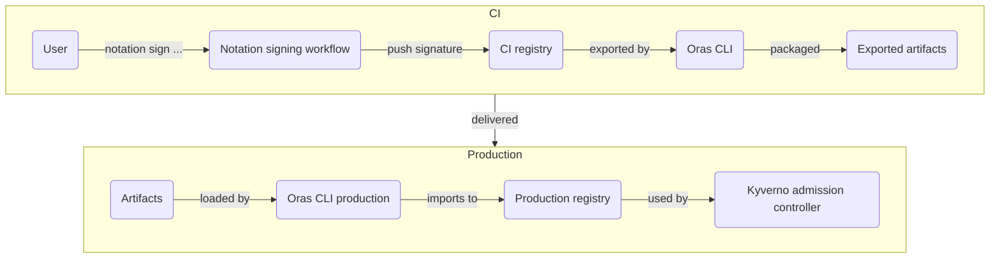

# Moving signatures from CI to Prod

Key part of the problem is moving signatures along with images from CI registry
to Production registry. Notation as of right now only signs images in a
registry and if product is shipped to customer as a delivery (airgap
installations for example), some extra steps are needed.

## Make targets

`make test` to run full test, and `make clean` to clean it up. Makefile targets
utilize Notation's Makefile for signing containers.

Run `make` to get all meaningful make targets, and check the Makefile itself
for all targets.

## Exporting signatures as blobs with Oras

[Oras](https://oras.book/) is capable of handling Notation signatures, as well
as any OCI artifacts in a registry.



Oras has
[documentation](https://oras.land/docs/how_to_guides/distributing_oci_layouts)
specifically for this.

```shell
# sign with notation first, then export to oci layout
# note: use a "tag", not sha in oci layout and include --recursive to copy signatures too
$ oras cp --recursive --from-plain-http 127.0.0.1:5002/busybox@sha256:28e01ab32c9dbcbaae96cf0d5b472f22e231d9e603811857b295e61197e40a9b --to-oci-layout busybox:1.36.1-glibc
...

# package the oci-layout into tarball for delivery
$ tar -cf busybox.tar busybox

# move tarball to prod, and unpack tarball
$ tar -xf busybox.tar

# push from oci-layout to registry
$ oras cp --recursive --from-oci-layout busybox:1.36.1-glibc --to-plain-http 127.0.0.1:5000/busybox:1.36.1-glibc
Copied [oci-layout] busybox:1.36.1-glibc => [registry] 127.0.0.1:5000/busybox:1.36.1-glibc
Digest: sha256:28e01ab32c9dbcbaae96cf0d5b472f22e231d9e603811857b295e61197e40a9b

# verify the copied images signatures with notation
$ notation verify --insecure-registry 127.0.0.1:5000/busybox@sha256:28e01ab32c9dbcbaae96cf0d5b472f22e231d9e603811857b295e61197e40a9b
Successfully verified signature for 127.0.0.1:5000/busybox@sha256:28e01ab32c9dbcbaae96cf0d5b472f22e231d9e603811857b295e61197e40a9b

# inspect signature
$ notation inspect --insecure-registry 127.0.0.1:5000/busybox
Inspecting all signatures for signed artifact
127.0.0.1:5000/busybox@sha256:28e01ab32c9dbcbaae96cf0d5b472f22e231d9e603811857b295e61197e40a9b
└── application/vnd.cncf.notary.signature
    └── sha256:724e90a163d792655803ebd579e61523dc40512099842139f922dc65c3431a4e
        ├── media type: application/jose+json
        ├── signature algorithm: RSASSA-PSS-SHA-512
        ├── signed attributes
        │   ├── signingScheme: notary.x509
        │   └── signingTime: Thu Mar 21 08:54:23 2024
        ├── user defined attributes
        │   └── (empty)
        ├── unsigned attributes
        │   └── signingAgent: Notation/1.0.0 external-signer/v0.1.0+unreleased
        ├── certificates
        │   ├── SHA256 fingerprint: df3cc01f956e06610b52d2d8922949e9fb605d7c8b3b9b74cc4d136d732fc562
        │   │   ├── issued to: CN=Notation.leaf
        │   │   ├── issued by: CN=Notation Root CA,O=Notation
        │   │   └── expiry: Fri Mar 21 06:54:23 2025
        │   └── SHA256 fingerprint: 680ad58c555df9437b9485c5f4a7e023c7685dd38e5be3e56d6e5bd5fa0110e6
        │       ├── issued to: CN=Notation Root CA,O=Notation
        │       ├── issued by: CN=Notation Root CA,O=Notation
        │       └── expiry: Fri Mar 21 06:54:21 2025
        └── signed artifact
            ├── media type: application/vnd.docker.distribution.manifest.v2+json
            ├── digest: sha256:28e01ab32c9dbcbaae96cf0d5b472f22e231d9e603811857b295e61197e40a9b
            └── size: 527

```

## Using Skopeo to move signatures from one registry to another

Originally, tool investigated for packaging was Skopeo, but
[Skopeo is not supporting Notation signatures yet](https://github.com/containers/skopeo/issues/2227)
