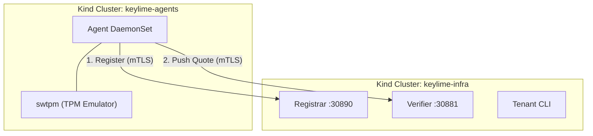

# Keylime Push Model POC

Proof-of-Concept: **Keylime 8.x push model agent** running as a non-root
DaemonSet in Kubernetes, attesting to a Keylime server via hardware TPM
or swtpm.

## Architecture



Two separate Kind clusters simulate cross-network attestation. The agent
initiates all connections (egress only, no ingress needed). For hardware
TPM mode, a QEMU VM with vTPM replaces the agent Kind cluster.

## Quick Start

Prerequisites: Docker, Kind, `kubectl`, `openssl`, `skopeo`, and
keylime repos cloned locally (`KEYLIME_GIT`, `RUST_KEYLIME_GIT`).

```bash
make setup          # Build container images (one-time)
make swtpm          # Full POC with software TPM (default)
make hwtpm          # Full POC with hardware TPM (QEMU vTPM)
make verify         # Re-check attestation status
make clean          # Tear down everything
```

`make swtpm` deploys 2 agent clusters (configurable: `AGENT_CLUSTERS=N`).
`make hwtpm` boots a QEMU VM with vTPM, kubeadm, and device plugin.

A TPM policy with at least one PCR is required. With swtpm, PCR values
are all zeros. With hardware TPM, use an unused PCR (e.g., PCR 8) for
testing since PCRs 0-7 contain real boot measurements.

## Production Deployment Guide

Key learnings for deploying the push model agent as a non-root container
with hardware TPM.

### Container Runtime

The runtime **must** set device ownership from the pod's security
context. Without this, the non-root agent cannot access `/dev/tpmrm0`.

containerd (v1.6+) -- change the existing key in `config.toml`
(do not insert a duplicate, containerd will refuse to start):

```toml
# /etc/containerd/config.toml
[plugins."io.containerd.grpc.v1.cri"]
  device_ownership_from_security_context = true
```

CRI-O (v1.22+):

```toml
# /etc/crio/crio.conf
[crio.runtime]
device_ownership_from_security_context = true
```

This eliminates `supplementalGroups` hacks (where the `tss` GID varies
by distro: 59 on SLES/Fedora, 106 on Debian).

### Device Plugin

Deploy [squat/generic-device-plugin][gdp] to expose `/dev/tpmrm0` as
`squat.ai/tpm`. See [device-plugin.yaml](k8s/agents/device-plugin.yaml).
Only the device plugin DaemonSet needs `privileged: true`.

[gdp]: https://github.com/squat/generic-device-plugin

### UID/GID Matching

The agent UID/GID must be consistent across:

| Layer | Where | How |
| --- | --- | --- |
| Container image | `Dockerfile` `groupadd`/`useradd` | `ARG KEYLIME_UID=490` / `ARG KEYLIME_GID=490` |
| DaemonSet | `securityContext` | `runAsUser: 490` / `runAsGroup: 490` |
| Node (if relevant) | `/etc/passwd`, `/etc/group` | Must match if sharing host paths |

Default 490 matches the `keylime` system user on SLES. On SLES the `tss`
group is GID 59; on Debian it is 106. With
`device_ownership_from_security_context`, `tss` group membership is not
required for hardware TPM mode.

### Agent Security Context

```yaml
securityContext:
  runAsUser: 490
  runAsGroup: 490
  runAsNonRoot: true
  allowPrivilegeEscalation: false
  capabilities:
    drop:
    - ALL
```

No `privileged`, no added capabilities, no `supplementalGroups`, no init
container (unlike swtpm mode which needs a root init container).

### Agent Environment Variables

```yaml
env:
- name: TCTI
  value: "device:/dev/tpmrm0"    # Use hardware TPM
- name: KEYLIME_AGENT_RUN_AS
  value: ""                       # Disable internal privilege drop
```

`KEYLIME_AGENT_RUN_AS=""` is critical. The agent's built-in `run_as`
expects to start as root and drop privileges. When K8s already runs the
container as non-root, the internal drop fails.

### TPM Policy

Hardware TPM PCR values contain real firmware/boot measurements (not
all zeros). Keylime's `tpm_policy` uses **exact match**, not regex.
Static PCR policies break on firmware or kernel updates.

For production, use measured boot event log verification. For testing,
use an unused PCR (e.g., PCR 8, typically all zeros):

```bash
tpm2_pcrread sha256:0,1,2,3,4,5,6,7,8
--tpm_policy '{"8":"000...000"}'
```

### TLS Certificate SANs

The server cert must include **every IP** the agent uses to reach the
registrar/verifier. Missing SANs cause silent mTLS failure at
capabilities negotiation (agent logs show Phase 1, then nothing).

### UUID Strategy

Use `uuid = "hash_ek"` (SHA-256 of TPM Endorsement Key) for stable
per-node identity that survives pod restarts.

### swtpm vs Hardware TPM

| Aspect | swtpm (dev/POC) | Hardware TPM (production) |
| --- | --- | --- |
| Init container | Required (root, initializes state) | Not needed |
| Device plugin | Not needed | Required (exposes `/dev/tpmrm0`) |
| `TCTI` env var | `swtpm:host=localhost,port=2321` | `device:/dev/tpmrm0` |
| PCR values | All zeros | Real boot measurements |
| EK certificate | Self-signed by swtpm | Manufacturer-signed (TPM vendor CA) |
| `require_ek_cert` | `False` (verifier config) | `True` for production |
| Measured boot log | Not available | `/sys/kernel/security/tpm0/binary_bios_measurements` |
| IMA log | Not available | Available if IMA enabled in kernel |

## Troubleshooting

- **PCR mismatch**: Check verifier logs (`kubectl logs -n keylime
  -l app=keylime-verifier --tail=20`) for the actual PCR value and
  update the policy.
- **Agent cannot connect**: Check agent logs. Ensure NodePorts are
  reachable and server cert SANs include the agent's target IP.
- **"challenges expired" (403)**: No TPM policy configured. You must
  specify `--tpm_policy` with at least one PCR when adding the agent.

## References

- [Keylime Documentation](https://keylime.dev/)
- [Keylime GitHub](https://github.com/keylime/keylime)
- [Keylime Rust Agent](https://github.com/keylime/rust-keylime)
- [squat/generic-device-plugin][gdp]
- [Kubernetes: Non-root Containers and Devices](https://kubernetes.io/blog/2021/11/09/non-root-containers-and-devices/)
- [SUSE Keylime Docs](https://documentation.suse.com/sle-micro/6.0/html/Micro-keylime/index.html)

<!-- cSpell:ignore keylime,swtpm,sles -->
