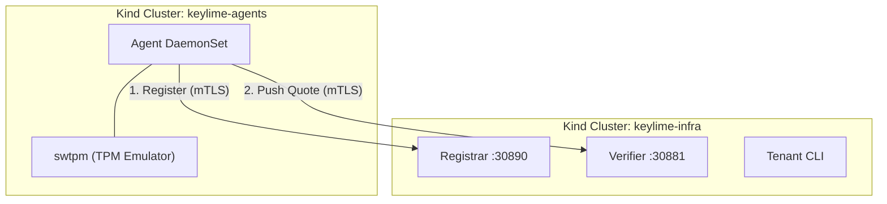

# Keylime Push Model POC

A Proof-of-Concept demonstrating **Keylime 8.x Push Model** attestation running
in Kubernetes.

This setup uses two separate [Kind](https://kind.sigs.k8s.io/) clusters to
simulate a real-world scenario where the **Agent** (workload) runs in a
different network environment than the **Keylime Infrastructure**
(Verifier/Registrar), connecting via standard egress (NodePorts).

## Architecture

The architecture consists of two clusters communicating via the host network.



- **Push Model**: The Agent initiates connections to the Verifier. No
   Ingress/LoadBalancer is required for the Agent.
- **mTLS**: All communication is secured using mutual TLS with certificates
   generated in [scripts/generate-certs.sh](scripts/generate-certs.sh).
- **TPM**: Uses `swtpm` to emulate a TPM 2.0 device for development.

## Quick Start

### Prerequisites

- Docker, Kind, `kubectl`, `openssl`, `skopeo`
- Keylime repositories cloned locally:
   - `KEYLIME_GIT` (Python server, default: `~/git/keylime/keylime`)
   - `RUST_KEYLIME_GIT` (Rust agent, default: `~/git/keylime/rust-keylime`)

### 1. Setup (Build Images)

Build the container images from your local Keylime sources. This builds the
`keylime_push_model_agent` binary.

```bash
make setup
```

*See [Makefile](Makefile) for build details.*

### 2. Run the POC

Deploy both server and agent clusters, then verify attestation:

```bash
make run
```

This runs:

- `make server` - Creates keylime-infra cluster with registrar/verifier
- `make test` - Creates keylime-agents cluster with agent, adds to verifier,
  verifies attestation

### 3. Verify Attestation

To re-check attestation status without redeploying:

```bash
make verify
```

To run a fresh test iteration (recreates agent cluster):

```bash
make test
```

**Important**: A TPM policy with at least one PCR is required for attestation.
With `swtpm`, PCR values are all zeros since no real boot measurements exist.

## Configuration

### Certificates

Certificates are generated automatically by
[scripts/generate-certs.sh](scripts/generate-certs.sh) into the `certs/`
directory and mounted as Kubernetes Secrets.

- **CA**: Shared root of trust for both clusters.
- **Server Certs**: Used by Registrar and Verifier.
- **Client Certs**: Used by Agent and Tenant.

### Infrastructure Configuration

The infrastructure components are configured via ConfigMaps in
[k8s/infra/configmaps/](k8s/infra/configmaps/).

- **Verifier**: [verifier.conf](k8s/infra/configmaps/verifier.conf) sets
  `mode = push` and `require_ek_cert = False` (for swtpm).
- **Registrar**: [registrar.conf](k8s/infra/configmaps/registrar.conf)
  configures TLS and database.

### Agent Configuration

The Agent is configured via a ConfigMap in
[k8s/agents/agent-configmap.yaml](k8s/agents/agent-configmap.yaml).

- **UUID**: Generated dynamically on each agent start.
- **Registrar/Verifier**: Point to the host IP (via `host.docker.internal` or
  gateway) on NodePorts `30890` and `30881`.

## Troubleshooting

### PCR Mismatch

If the agent fails attestation with a PCR mismatch error in the Verifier logs:

1. Check the actual PCR value in the logs:

   ```bash
   kubectl logs -n keylime -l app=keylime-verifier --tail=20
   ```

2. Update the policy in your `tenant add` command to match the value reported
   by `swtpm`.

### Networking Issues

If the Agent cannot connect to the Registrar/Verifier:

1. Check Agent logs:

   ```bash
   kubectl logs -n keylime -l app=keylime-agent
   ```

2. Ensure the NodePorts are accessible from the Agent container. The `start.sh`
   script attempts to resolve the host IP.

### "Challenges Expired"

If you see `challenges_expired` (403) in Agent logs:

- **Most likely cause**: No TPM policy configured. When adding the agent to
  the verifier, you must specify `--tpm_policy` with at least one PCR.
  Without a policy, no TPM quote is requested, so no challenge is generated.
- Can also happen if the Agent takes too long to respond, or during rapid
  restart loops.

## Source Reference

- **Agent Deployment**:
  [k8s/agents/agent-daemonset.yaml](k8s/agents/agent-daemonset.yaml)
- **Verifier Deployment**:
  [k8s/infra/verifier-deployment.yaml](k8s/infra/verifier-deployment.yaml)
- **Agent Dockerfile**: [k8s/agents/agent/Dockerfile](k8s/agents/agent/Dockerfile)
