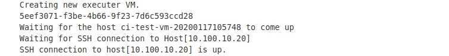

# Jenkins

## Access to Nordix Jenkins

You can access to Nordix [Jenkins](https://jenkins.nordix.org/view/Metal3/)
with your Google account.

## Daily steps to ensure successfullness of Jenkins CI

**Note: you can run `jenkins-check-ci.sh` script to check CI job statuses**

- jenkins-jobs-to-scan.txt lists string patterns used for checking
- running from your local repo
- running from cli by remotely accessing github, no need for local repo

  <!-- markdownlint-disable MD013 -->
  ```bash
  wget -q https://raw.githubusercontent.com/Nordix/metal3-dev-tools/master/wow/jenkins_ci/jenkins-jobs-to-scan.txt | sleep 1 | bash <(curl -Ls https://raw.githubusercontent.com/Nordix/metal3-dev-tools/master/wow/jenkins_ci/jenkins-check-ci.sh) && rm jenkins-jobs-to-scan.txt*
  ```
  <!-- markdownlint-enable MD013 -->

- a customized jenkins-jobs-to-scan.txt can be used by running (wget run once
  to fetch `jenkins-jobs-to-scan.txt`)

  ```bash
  bash <(curl -Ls https://raw.githubusercontent.com/Nordix/metal3-dev-tools/master/wow/jenkins_ci/jenkins-check-ci.sh)
  ```

Check global status of jobs which are built on a daily basis (Jobs with prefix 'metal3_daily_'):
[Metal3 periodic jobs](https://jenkins.nordix.org/view/Metal3%20Periodic/)

You should see successfull run indication.

In case of job **FAILURE**:

- first check the job's logs (```console output```) to get more info.
- check what are the PRs that were merged last time, which could potentially
  cause CI failure.

## Some of common causes of failure that you might encounter

<!-- markdownlint-disable MD013 -->
- `E: Could not get lock /var/lib/dpkg/lock-frontend - open (11: Resource temporarily unavailable)`
- `"Unable to connect to the server: dial tcp 192.168.39.150:8443: connect: no route to host`
- `"Error from server: error when creating "STDIN": etcdserver: request timed out"`
- `Failed due to timeout` - sometimes job might fail because of the timeout
  which could happen due to slowleness of Cleura infrastructure.
<!-- markdownlint-enable MD013 -->

## How to resolve the above failures

Just trigger the CI manually because these causes aren't results of any pull
request but rather system instability.

## Possible sources of notifications on CI failures

- First place to notice the CI failure is
  [Nordix Jenkins UI](https://jenkins.nordix.org/view/Metal3/)
- Metal3 [Slack channel](https://kubernetes.slack.com/messages/CHD49TLE7)
  `#cluster-api-baremetal`
- Metal3 [Mailing list](https://groups.google.com/forum/#!forum/metal3-dev)

## Workflow of Nordix Jenkins CI

First based on a trigger-phrase from an open PR or on a daily basis,
Jenkins Job Builder (JJB) builds a Jenkins CI job, which will execute
the steps given in the corresponding pipeline (example:
[integration_tests.pipeline](https://github.com/metal3-io/project-infra/blob/main/jenkins/jobs/integration_tests.pipeline))

**Note:** You will find JJB files in [Nordix
Gerrit](https://gerrit.nordix.org/admin/repos/infra/cicd) and Jenkins
pipelines in
[project-infra](https://github.com/metal3-io/project-infra/blob/main/jenkins/jobs).

When a job is triggered either by trigger-phrase or a timer, it
is executed in one of the Jenkins workers VM
 (example:```metal3-static0-workers-*```), which is running on
 **Default_Project_37137** of [Cleura](https://cleura.cloud/).

In order to access the VM where the job is running:

1. Find the name of the Jenkins slave (from
   [Jenkins](https://jenkins.nordix.org/view/Metal3/)) that is executing the
   job.
1. Go to [Cleura](https://cleura.cloud/)
   console and get the floating IP of the corresponding Jenkins worker VM.
1. Find the IP of the VM  from Jenkins job's **console_output**, which is
   created for running actual integration test. See example screenshot:

   

1. SSH into the Jenkins worker VM with its floating IP that you found in step 2
   and from there SSH into the actual tester VM with its own IP that you found
   in step3.

  **Note:** to SSH the Jenkins worker VM you need an metal3ci SSH key.
  If needed run `ssh-add -l` to check that the key is loaded to ssh-agent.
  `ssh metal3ci@'Jenkins-worker-VM-IP' -A` and `ssh 'tester-VM-IP'`

1. Once you are inside the tester VM you can debug it and get more info.

## How to clean up leftover VMs from Cleura

There is a Jenkins [job](https://jenkins.nordix.org/view/Metal3%20Periodic/job/metal3_daily_main_integration_tests_cleanup/)
that every 6 hours cleans up all the leftover VMs, which failed to be
deleted at the end of integration test.

**Note:** If you want to trigger cleaning job manually, you can use the
`/test-clean` phrase within an open pull request under
[metal3-io/project-infra](https://github.com/metal3-io/project-infra)
repo.
